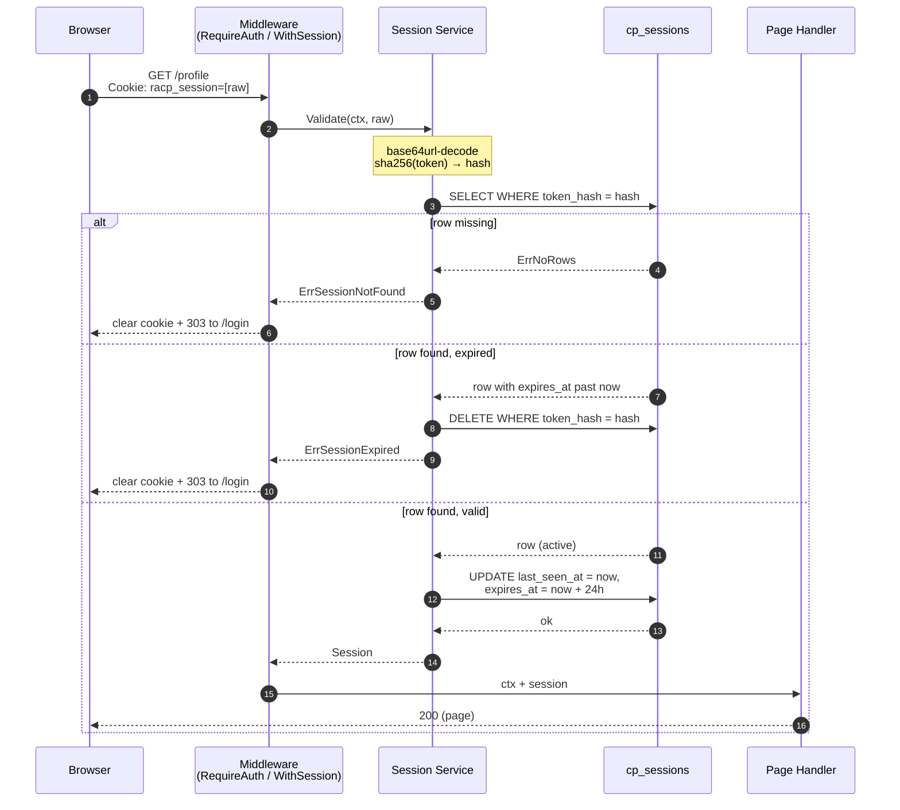

# Opaque Session Token — Login &amp; Authentication
---

## 1. Login — token creation

```mermaid
sequenceDiagram
    autonumber
    participant B as Browser
    participant H as Handler<br>(transport)
    participant A as Auth Service<br>(app)
    participant S as Session Service<br>(app)
    participant D as cp_sessions<br>(DB)

    B->>H: POST /login (username, password)
    H->>A: Authenticate(cmd)
    A-->>H: GetDTO with ID, Username, Email
    H->>S: Create(ctx, userID)
    Note over S: rand.Read 32 bytes → token<br>sha256(token) → hash<br>now, now+24h
    S->>D: INSERT token_hash, user_id,<br>expires_at, last_seen_at, created_at
    D-->>S: ok
    S-->>H: raw token + Session
    H-->>B: 303 to /<br>Set-Cookie: racp_session=[raw token]<br>HttpOnly; SameSite=Lax; Max-Age=86400
```

---
## 2. Authenticated request — validate &amp; slide

