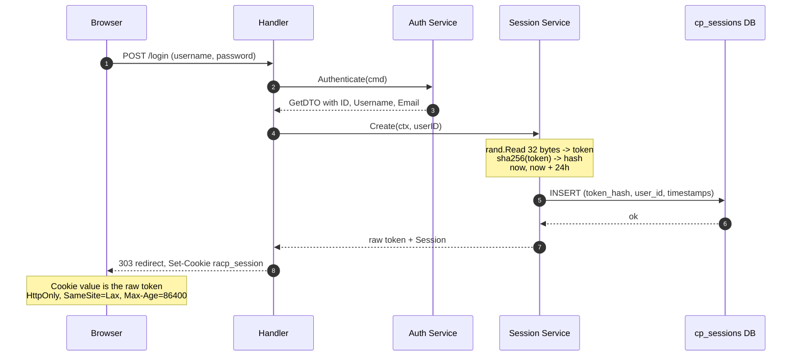
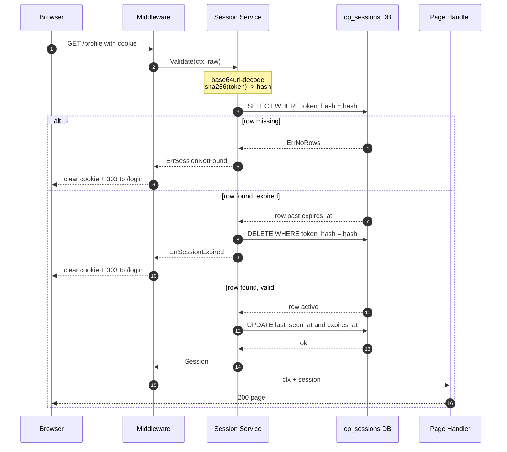

# Opaque Session Token — Login &amp; Authentication
---

## 1. Login — token creation

The raw token only ever lives in the cookie and (briefly) in the service's local variable. The DB sees only `SHA-256(token)`.

---

## 2. Authenticated request — validate &amp; slide

Every authenticated request bumps `expires_at` by 24h (sliding window). Active users stay logged in; idle 24h logs them out. `WithSession` follows the same flow but lets anonymous requests through unchanged.
